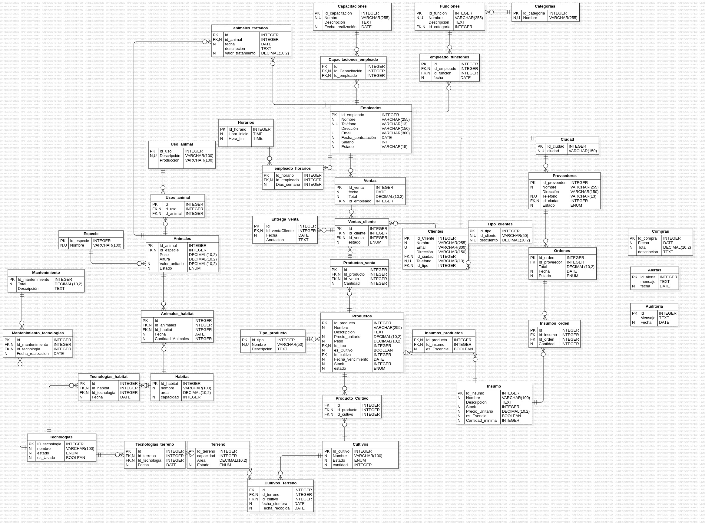

<h1> La Huerta Encantada - MySQL Data Base 🌸</h1>

<p align="center">
  
</p>


Este proyecto tiene como objetivo diseñar y desarrollar una base de datos integral que permita gestionar de manera eficiente todas las operaciones relacionadas con la producción agrícola de la finca. La implementación de esta base de datos facilitará el seguimiento de cultivos, la gestión de maquinaria, el control de ventas y la administración de recursos humanos, proporcionando una herramienta que permita una toma de decisiones informada y ágil.

## Tabla de Contenidos
- [Identificación del Problema](#problema)
- [Entidad-Relación](#entidad-relación)
- [Diagrama Lógico](#diagrama)
- [Instalación](#instalación)
- [Consultas](#consultas)
- [Eventos Programados](#eventos)
- [Triggers](#triggers)
- [Funciones](#funciones)
- [Procedimientos Almacenados](#procedimientos)
- [Contacto](#contacto)


## Problema

En un contexto agrícola cada vez más competitivo, la optimización de recursos y la gestión eficiente de procesos se han convertido en factores cruciales para el éxito de cualquier finca. "La Huerta Encantada", una finca dedicada a la producción de diversos cultivos se enfrenta al desafío de administrar de manera efectiva sus operaciones diarias.

La falta de un sistema centralizado para gestionar las diversas áreas de producción, desde el control de inventarios hasta la gestión de empleados y la relación con proveedores y clientes, generan ineficiencias que impactan negativamente en la productividad y rentabilidad de la finca.


## Entidad-Relación

A continuación encontrarás la expliación de las entidades y relaciones:


## Entidades y Atributos

### 1. **Categoría**
   - **Descripción**: Clasifica las funciones de los empleados.
   - **Atributos**:
     - `id_categoria`: Identificador único.
     - `nombre`: Nombre de la categoría (único).

### 2. **Funciones**
   - **Descripción**: Define las funciones desempeñadas por los empleados.
   - **Atributos**:
     - `id_funcion`: Identificador único.
     - `nombre`: Nombre de la función (único).
     - `descripcion`: Descripción de la función.
     - `id_categoria`: Relación con la tabla `Categoría`.

### 3. **Empleado**
   - **Descripción**: Almacena información sobre los empleados.
   - **Atributos**:
     - `id_empleado`: Identificador único.
     - `nombre`: Nombre del empleado.
     - `telefono`: Teléfono del empleado (único).
     - `direccion`: Dirección del empleado.
     - `email`: Correo electrónico del empleado (único).
     - `fecha_contratacion`: Fecha de contratación.
     - `salario`: Salario del empleado.
     - `estado`: Estado del empleado.

### 4. **Empleado_Funciones**
   - **Descripción**: Relaciona empleados con sus funciones.
   - **Atributos**:
     - `id`: Identificador único.
     - `id_empleado`: Relación con `Empleado`.
     - `id_funcion`: Relación con `Funciones`.
     - `fecha`: Fecha de asignación.

### 5. **Capacitaciones**
   - **Descripción**: Información sobre las capacitaciones ofrecidas a los empleados.
   - **Atributos**:
     - `id_capacitacion`: Identificador único.
     - `nombre`: Nombre de la capacitación (único).
     - `descripcion`: Descripción de la capacitación.
     - `fecha_realizacion`: Fecha de realización.

### 6. **Empleado_Capacitaciones**
   - **Descripción**: Relaciona empleados con las capacitaciones que han recibido.
   - **Atributos**:
     - `id`: Identificador único.
     - `id_empleado`: Relación con `Empleado`.
     - `id_capacitacion`: Relación con `Capacitaciones`.

### 7. **Horarios**
   - **Descripción**: Define los horarios de trabajo de los empleados.
   - **Atributos**:
     - `id_horario`: Identificador único.
     - `hora_inicio`: Hora de inicio.
     - `hora_fin`: Hora de fin.

### 8. **Empleado_Horarios**
   - **Descripción**: Relaciona empleados con sus horarios de trabajo.
   - **Atributos**:
     - `id`: Identificador único.
     - `id_empleado`: Relación con `Empleado`.
     - `id_horario`: Relación con `Horarios`.
     - `dias_semana`: Días de la semana aplicables.

### 9. **Ciudad**
   - **Descripción**: Información sobre las ciudades.
   - **Atributos**:
     - `id_ciudad`: Identificador único.
     - `nombre`: Nombre de la ciudad (único).

### 10. **Tipo_Cliente**
- **Descripción**: Define los tipos de clientes y sus descuentos.
- **Atributos**:
    - `id_tipo`: Identificador único.
    - `nombre`: Nombre del tipo (único).
    - `descuento`: Descuento asociado.

### 11. **Cliente**
- **Descripción**: Almacena información sobre los clientes.
- **Atributos**:
      - `id_cliente`: Identificador único.
      - `nombre`: Nombre del cliente.
      - `telefono`: Teléfono del cliente (único).
      - `direccion`: Dirección del cliente.
      - `email`: Correo electrónico del cliente (único).
      - `id_ciudad`: Relación con `Ciudad`.
      - `id_tipo`: Relación con `Tipo_Cliente`.

### 12. **Proveedor**
- **Descripción**: Información sobre los proveedores.
- **Atributos**:
      - `id_proveedor`: Identificador único.
      - `nombre`: Nombre del proveedor.
      - `direccion`: Dirección del proveedor.
      - `telefono`: Teléfono del proveedor (único).
      - `id_ciudad`: Relación con ` Ciudad`.
      - `estado`: Estado del proveedor.

### 13. **Orden**
- **Descripción**: Registra las órdenes de compra a proveedores.
- **Atributos**:
    - `id_orden`: Identificador único.
    - `id_proveedor`: Relación con `Proveedor`.
    - `total`: Total de la orden.
    - `fecha`: Fecha de la orden.
    - `estado`: Estado de la orden.

### 14. **Insumos**
- **Descripción**: Información sobre los insumos utilizados en la producción.
- **Atributos**:
    - `id_insumo`: Identificador único.
    - `nombre`: Nombre del insumo.
    - `descripcion`: Descripción del insumo.
    - `stock`: Cantidad disponible.
    - `Precio_unitario`: Precio unitario.
    - `stock_minimo`: Stock mínimo permitido.

### 15. **Insumos_Orden**
- **Descripción**: Relaciona insumos con las órdenes de compra.
- **Atributos**:
    - `id_insumo`: Relación con `Insumos`.
    - `id_orden`: Relación con `Orden`.
    - `cantidad`: Cantidad de insumos en la orden.

### 16. **Tipo_Producto**
- **Descripción**: Define los tipos de productos.
- **Atributos**:
    - `id_tipo`: Identificador único.
    - `nombre`: Nombre del tipo (único).
    - `descripcion`: Descripción del tipo.

### 17. **Cultivo**
- **Descripción**: Información sobre los cultivos.
- **Atributos**:
    - `id_cultivo`: Identificador único.
    - `nombre`: Nombre del cultivo.
    - `estado`: Estado del cultivo.
    - `cantidad`: Cantidad disponible.

### 18. **Producto**
- **Descripción**: Almacena información sobre los productos.
- **Atributos**:
      - `id_producto`: Identificador único.
      - `nombre`: Nombre del producto (único).
      - `descripcion`: Descripción del producto.
      - `precio_unitario`: Precio unitario.
      - `peso`: Peso del producto.
      - `es_Cultivo`: Indica si es un cultivo.
      - `id_cultivo`: Relación con `Cultivo`.
      - `id_tipo`: Relación con `Tipo_Producto`.
      - `stock`: Cantidad disponible.
      - `fecha_vencimiento`: Fecha de vencimiento.
      - `estado`: Estado del producto.

### 19. **Insumos_Producto**
- **Descripción**: Relaciona insumos con productos.
- **Atributos**:
    - `id_insumo`: Relación con `Insumos`.
    - `id_producto`: Relación con `Producto`.
    - `es_Escencial`: Indica si el insumo es esencial.

### 20. **Terreno**
- **Descripción**: Información sobre los terrenos.
- **Atributos**:
    - `id_terreno`: Identificador único.
    - `capacidad`: Capacidad del terreno.
    - `area`: Área del terreno.
    - `estado`: Estado del terreno.

### 21. **Cultivos_Terreno**
- **Descripción**: Relaciona cultivos con terrenos.
- **Atributos**:
    - `id_cultivo`: Relación con `Cultivo`.
    - `id_terreno`: Relación con `Terreno`.
    - `fecha_siembra`: Fecha de siembra.
    - `fecha_recoger`: Fecha de recoger.

### 22. **Tecnologias**
- **Descripción**: Información sobre las tecnologías utilizadas.
- **Atributos**:
    - `id_tecnologia`: Identificador único.
    - `nombre`: Nombre de la tecnología.
    - `estado`: Estado de la tecnología.
    - `es_Usado`: Indica si está en uso.

### 23. **Tecnologias_Terreno**
- **Descripción**: Relaciona tecnologías con terrenos.
- **Atributos**:
    - `id_tecnologia`: Relación con `Tecnologias`.
    - `id_terreno`: Relación con `Terreno`.
    - `fecha`: Fecha de asignación.

### 24. **Mantenimiento**
- **Descripción**: Información sobre los mantenimientos realizados.
- **Atrib utos**:
    - `id_mantenimiento`: Identificador único.
    - `nombre`: Nombre del mantenimiento (único).
    - `descripcion`: Descripción del mantenimiento.
    - `total`: Total del mantenimiento.

### 25. **Mantenimiento_Tecnologia**
- **Descripción**: Relaciona mantenimientos con tecnologías.
- **Atributos**:
    - `id_tecnologia`: Relación con `Tecnologias`.
    - `id_mantenimiento`: Relación con `Mantenimiento`.
    - `fecha_realizacion`: Fecha de realización.

### 26. **Habitat**
- **Descripción**: Información sobre los hábitats.
- **Atributos**:
    - `id_habitat`: Identificador único.
    - `nombre`: Nombre del hábitat.
    - `area`: Área del hábitat.
    - `capacidad`: Capacidad del hábitat.

### 27. **Habitats_Tecnologias**
- **Descripción**: Relaciona hábitats con tecnologías.
- **Atributos**:
    - `id_tecnologia`: Relación con `Tecnologias`.
    - `id_habitat`: Relación con `Habitat`.
    - `fecha`: Fecha de asignación.

### 28. **Uso_Animal**
- **Descripción**: Define los usos de los animales.
- **Atributos**:
    - `id_uso`: Identificador único.
    - `descripcion`: Descripción del uso.
    - `produccion`: Producción asociada.

### 29. **Especie**
- **Descripción**: Información sobre las especies de animales.
- **Atributos**:
    - `id_especie`: Identificador único.
    - `nombre`: Nombre de la especie (único).

### 30. **Animal**
- **Descripción**: Almacena información sobre los animales.
- **Atributos**:
    - `id_animal`: Identificador único.
    - `id_especie`: Relación con `Especie`.
    - `peso`: Peso del animal.
    - `altura`: Altura del animal.
    - `valor_unitario`: Valor unitario.
    - `estado`: Estado del animal.

### 31. **Usos_Animal**
- **Descripción**: Relaciona usos con animales.
- **Atributos**:
    - `id_uso`: Relación con `Uso_Animal`.
    - `id_animal`: Relación con `Animal`.

### 32. **Animales_Habitat**
- **Descripción**: Relaciona animales con hábitats.
- **Atributos**:
    - `id_animal`: Relación con `Animal`.
    - `id_habitat`: Relación con `Habitat`.
    - `fecha`: Fecha de asignación.

### 33. **Venta**
- **Descripción**: Registra las ventas realizadas.
- **Atributos**:
    - `id_venta`: Identificador único.
    - `id_empleado`: Relación con `Empleado`.
    - `fecha`: Fecha de la venta.
    - `total`: Total de la venta.

### 34. **Productos_Venta**
- **Descripción**: Relaciona productos con ventas.
- **Atributos**:
    - `id_venta`: Relación con `Venta`.
    - `id_producto`: Relación con `Producto`.
    - `cantidad`: Cantidad vendida.

### 35. **Cliente_Venta**
- **Descripción**: Relaciona clientes con ventas.
- **Atributos**:
    - `id_venta`: Relación con `Venta`.
    - `id_cliente`: Relación con `Cliente`.
    - `estado`: Estado de la venta.

### 36. **Entrega_Venta**
- **Descripción**: Registra las entregas de ventas.
- **Atributos**:
    - `id_entrega`: Identificador único.
    - `id_venta`: Relación con `Venta`.
    - `fecha`: Fecha de entrega.
    - `anotacion`: Anotación de la entrega.

### 37. **Alertas**
- **Descripción**: Información sobre las alertas generadas.
- **Atributos**:
    - `id_alerta`: Identificador único.
    - `mensaje`: Mensaje de la alerta.
    - `fecha`: Fecha de la alerta.

### 38. **Compras**
- **Descripción**: Registra las compras realizadas.
- **Atributos**:
    - `id_compra `: Identificador único.
    - `descripcion`: Descripción de la compra.
    - `fecha`: Fecha de la compra.
    - `total`: Total de la compra.

### 39. **Auditoria**
- **Descripción**: Información sobre las auditorías realizadas.
- **Atributos**:
    - `id_auditoria`: Identificador único.
    - `mensaje`: Mensaje de la auditoría.
    - `fecha`: Fecha de la auditoría.

### 40. **Animales_Tratados**
- **Descripción**: Registra los tratamientos de animales.
- **Atributos**:
    - `id_animal`: Relación con `Animal`.
    - `id_empleado`: Relación con `Empleado`.
    - `fecha`: Fecha del tratamiento.
    - `descripcion`: Descripción del tratamiento.
    - `valor_tratamiento`: Valor del tratamiento.

## Relaciones

1. Un empleado puede tener varias funciones `(Empleado_Funciones)`.
2. Un empleado puede tener varias capacitaciones `(Empleado_Capacitaciones)`.
3. Un empleado puede tener varios horarios `(Empleado_Horarios)`.
4. Un proveedor puede tener varias órdenes `(Orden)`.
5. Un insumo puede estar en varias órdenes `(Insumos_Orden)`.
6. Un producto puede tener varios insumos `(Insumos_Producto)`.
7. Un cultivo puede estar en varios terrenos `(Cultivos_Terreno)`.
8. Un terreno puede tener varias tecnologías `(Tecnologias_Terreno)`.
9. Una tecnología puede tener varios mantenimientos `(Mantenimiento_Tecnologia)`.
10. Un hábitat puede tener varias tecnologías `(Habitats_Tecnologias)`.
11. Un animal puede tener varios usos `(Usos_Animal)`.
12. Un animal puede estar en varios hábitats `(Animales_Habitat)`.
13. Una venta puede tener varios productos `(Productos_Venta)`.
14. Una venta puede tener un cliente `(Cliente_Venta)`.
15. Una entrega puede tener una venta `(Entrega_Venta)`.
16. Un empleado puede tratar varios animales `(Animales_Tratados)`.


## Diagrama


## Instalación
1. Clona este repositorio, para obtener una copia local del proyecto:
   ```bash
   git clone https://github.com/LauraAmaya08/MySQLII_proyecto_LauraAmaya/
2. Con ayuda de las consultas referidas a continuación, ¡Explora la base de datos!

## Consultas

## Eventos 

## Triggers

### 1. Registrar compras de insumos. 

```sql
DELIMITER //
CREATE TRIGGER registrar_compra_insumo
AFTER INSERT ON insumos_orden
FOR EACH ROW
BEGIN
    INSERT INTO compras (fecha ,total) 
    VALUES (concat('Compra insumo! ID:', new.id_insumo), NOW(), new.cantidad);
    UPDATE insumos 
    SET stock = stock + new.cantidad
    WHERE id_insumo = new.id_insumo;
END//
DELIMITER ;
```
### 2. Actualizar stock de productos tras una venta. 
```sql
DELIMITER //
CREATE TRIGGER actualizar_stock
AFTER INSERT ON productos_venta
FOR EACH ROW
BEGIN
    UPDATE producto 
    SET stock = stock - new.cantidad
    WHERE new.id_producto = producto.id_producto;
END//
DELIMITER ;
```
### 3. Enviar alerta cuando se despide un empleado.
```sql
DELIMITER //
CREATE TRIGGER alerta_despido_empleado
AFTER UPDATE ON empleado
FOR EACH ROW
BEGIN
    IF new.estado = 'Inactivo' THEN
    INSERT INTO auditoria (mensaje,fecha) 
    VALUES (concat('Empleado despedido! ID: ', old.id_empleado), NOW());
    END IF;
END//
DELIMITER ;
```
### 4. Notificar a un empleado al ser asignado a una nueva función. 
```sql
DELIMITER //
CREATE TRIGGER alerta_modificacion_funcion
AFTER UPDATE ON empleado_funciones
FOR EACH ROW
BEGIN
    IF new.id_funcion <> old.id_funcion THEN
    INSERT INTO auditoria (mensaje,fecha) 
    VALUES (concat('Funciones de empleado ', old.id_empleado, ' actualizadas! Nueva función: ',new.id_funcion), NOW());
    END IF;
END//
DELIMITER ;

```
### 5. Registrar cada vez que se entrega un pedido. 
```sql
DELIMITER //
CREATE TRIGGER alerta_entrega_pedido
AFTER UPDATE ON cliente_venta
FOR EACH ROW
BEGIN
    IF new.estado = 'Entregado' THEN
    INSERT INTO alertas(mensaje,fecha) 
    VALUES (concat('Pedido Entregado! ID: ', old.id_venta, ' Cliente: ', old.id_cliente), NOW());
    INSERT INTO entrega_venta (id_venta, fecha, anotacion) VALUES
    (old.id_venta, now(), 'Pedido entregado correctamente');
    END IF;
END//
DELIMITER ;

```
###  6. Actualizar el historial de capacitaciones al inscribirse un empleado. 
```sql
DELIMITER //
CREATE TRIGGER actualizar_historial
AFTER INSERT ON empleado_capacitaciones
FOR EACH ROW
BEGIN
	INSERT INTO alertas(mensaje,fecha) 
    VALUES (concat('El empleado con ID: ', new.id_empleado, ' ha tomado la capacitación con ID ', new.id_capacitacion), NOW());
END//
DELIMITER ;

```
### 7. Notificar a los empleados sobre cambios de horarios. 
```sql
DELIMITER //
CREATE TRIGGER alerta_modificacion_horarios
AFTER UPDATE ON horarios
FOR EACH ROW
BEGIN
    IF new.hora_inicio <> old.hora_inicio OR new.hora_fin <> old.hora_fin THEN
    INSERT INTO auditoria (mensaje,fecha) 
    VALUES (concat('Atención empleados! si tu horario es ', old.hora_inicio, ' - ' ,old.hora_fin, ' tu horario se actualizó a ', new.hora_inicio, ' - ' ,new.hora_fin), NOW());
    END IF;
END//
DELIMITER ;
```
### 8. Notificar sobre vencimiento de productos. 
```sql
DELIMITER //
CREATE TRIGGER notificar_vencimiento_productos
BEFORE UPDATE ON producto
FOR EACH ROW
BEGIN
    DECLARE dias_restantes INT;
    SET dias_restantes = DATEDIFF(NEW.fecha_vencimiento, CURDATE());
    IF dias_restantes <= 30 AND dias_restantes >= 0 THEN
    INSERT INTO alertas (mensaje,fecha) 
    VALUES (concat('El producto ', NEW.nombre, ' está a punto de vencer en ', dias_restantes, ' días'), NOW());
    END IF;
END//
DELIMITER ;

```
### 9. Actualizar el estado de entrega de una venta.
```sql
DELIMITER //
CREATE TRIGGER actualizar_estado_entrega
AFTER UPDATE ON venta_cliente
FOR EACH ROW
BEGIN
    IF OLD.estado <> NEW.estado THEN
        INSERT INTO alertas (mensaje, fecha) 
        VALUES (CONCAT('El estado de la entrega de la venta ', NEW.id_venta, ' ha cambiado a ', NEW.estado), NOW());
    END IF;
END//
DELIMITER ;

```
### 10. Registrar cada vez que se realiza un mantenimiento.
```sql
DELIMITER //
CREATE TRIGGER registrar_mantenimiento
AFTER INSERT ON mantenimiento_tecnologia
FOR EACH ROW
BEGIN
    INSERT INTO alertas (mensaje, fecha) 
    VALUES (CONCAT('Mantenimiento registrado para la tecnología ', NEW.id_tecnologia), NOW());
END//
DELIMITER ;
```
### 11. Notificar a los clientes sobre nuevos productos. 
```sql
DELIMITER //
CREATE TRIGGER notificar_nuevos_productos
AFTER INSERT ON producto
FOR EACH ROW
BEGIN
    INSERT INTO alertas (mensaje, fecha) 
    VALUES (CONCAT('Nuevo producto disponible: ', NEW.nombre), NOW());
END//
DELIMITER ;


```
### 12. Crear un registro de auditoría tras eliminar una tecnología.
```sql
DELIMITER //
CREATE TRIGGER auditoria_eliminar_tecnologia
BEFORE DELETE ON tecnologias
FOR EACH ROW
BEGIN
    INSERT INTO auditoria (mensaje,fecha)
    VALUES (CONCAT('Tecnología eliminada: ', OLD.nombre), NOW());
END//
DELIMITER ;

```
### 13. Notificar cambios en precios de mantenimientos.
```sql
DELIMITER //
CREATE TRIGGER alerta_mantenimientos
AFTER UPDATE ON mantenimiento
FOR EACH ROW
BEGIN
    IF old.total <> new.total THEN
    INSERT INTO alertas(mensaje,fecha) 
    VALUES (concat('Atención! el nuevo precio de ', old.nombre, ' es: ', new.total), NOW());
    END IF;
END//
DELIMITER ;

```
### 14. Notificar animales enfermos

```sql
DELIMITER //
CREATE TRIGGER alerta_enfermos
AFTER UPDATE ON animal
FOR EACH ROW
BEGIN
    IF NEW.estado = 'Malo' THEN
        INSERT INTO alertas(mensaje, fecha) 
        VALUES (CONCAT('Atención el animal: ', NEW.id_animal, ' está enfermo!'), NOW());
    END IF;
END//
DELIMITER ;
```
### 15. Asignar automaticamente el estado de un producto desde su cultivo 
```sql
DELIMITER //
CREATE TRIGGER estado_producto
BEFORE INSERT ON producto
FOR EACH ROW
BEGIN
	DECLARE estado_cul VARCHAR(100);
    IF NEW.es_Cultivo = 1 THEN
    SELECT cul.estado INTO estado_cul FROM cultivo cul WHERE cul.id_cultivo = NEW.id_cultivo;
    SET NEW.estado = estado_cul;
    END IF;
END//
DELIMITER ;
```
### 16. Notificar la alerta de cantidad de insumos  
```sql
DELIMITER //
CREATE TRIGGER alerta_falta_insumos
AFTER UPDATE ON insumos
FOR EACH ROW
BEGIN
    IF NEW.stock <= NEW.stock_minimo THEN
        INSERT INTO alertas(mensaje, fecha) 
        VALUES (CONCAT('Atención, recarga en: ', NEW.nombre, '. Stock actual: ', NEW.stock), NOW());
    END IF;
END//
DELIMITER ;

```
### 17. Registrar venta por empleado
```sql
DELIMITER //
CREATE TRIGGER control_ventas_empleado
AFTER INSERT ON venta
FOR EACH ROW
BEGIN
	INSERT INTO alertas(mensaje, fecha) 
	VALUES (CONCAT('Venta realizada!, Encargado: ', NEW.id_empleado, '. Total: ', NEW.total), NOW());
END//
DELIMITER ;

```
### 18. Asignar fecha a venta 
```sql
DELIMITER //
CREATE TRIGGER fecha_venta
BEFORE INSERT ON venta
FOR EACH ROW
BEGIN
    SET NEW.fecha = now();
END//
DELIMITER ;


```
### 19. Registro de Tecnologías Usadas

```sql
DELIMITER //
CREATE TRIGGER registro_tecnologias_usadas
AFTER UPDATE ON tecnologias
FOR EACH ROW
BEGIN
		DECLARE nombre VARCHAR(200);
		IF NEW.es_Usado = 1 THEN 
        SELECT t.nombre INTO nombre FROM tecnologias t where t.id_tecnologia = NEW.id_tecnologia;
		INSERT INTO auditoria (mensaje, fecha) VALUES (CONCAT(' Tecnología en uso: ', nombre), NOW());
        END IF;
END//
DELIMITER ;
```
### 20. Actualización de Estado de Proveedor

```sql
DELIMITER //
CREATE TRIGGER actualizar_estado_proveedor
BEFORE UPDATE ON proveedor
FOR EACH ROW
BEGIN
    IF (SELECT COUNT(*) FROM orden WHERE id_proveedor = NEW.id_proveedor BETWEEN now() AND now() - INTERVAL 6 MONTH) = 0 THEN
        SET NEW.estado = 'Inactivo';
    END IF;
END//
DELIMITER ;

```

## Funciones

### 1. Calcular el total de ventas por cliente.

```sql
DELIMITER //
CREATE FUNCTION total_venta(ID_Cliente_e INT)
RETURNS INT
DETERMINISTIC
BEGIN
    DECLARE cantidad INT DEFAULT 0;
    SELECT count(id_venta) INTO cantidad FROM cliente_venta cv
    WHERE id_cliente = ID_Cliente_e;
    RETURN cantidad;
END//
DELIMITER ;
```
### 2. Obtener el promedio de stock de insumos.
```sql
DELIMITER //
CREATE FUNCTION promedio_insumos()
RETURNS DECIMAL(10,2)
DETERMINISTIC
BEGIN
    DECLARE promedio_stock DECIMAL(10,2) DEFAULT 0;
    SELECT avg(stock) INTO promedio_stock FROM insumos;
    RETURN promedio_stock;
END//
DELIMITER ;
```
### 3. Calcular el precio promedio de productos.
```sql
DELIMITER //
CREATE FUNCTION promedio_precio()
RETURNS DECIMAL(10,2)
DETERMINISTIC
BEGIN
    DECLARE promedio DECIMAL(10,2);
    SELECT avg(precio_unitario) INTO promedio FROM producto;
    RETURN promedio;
END//
DELIMITER ;
```
### 4. Determinar si un cultivo es rentable.
```sql
DELIMITER //
CREATE FUNCTION es_cultivo_rentable(id_producto_e INT)
RETURNS VARCHAR(15)
DETERMINISTIC
BEGIN
    DECLARE ingresos DECIMAL(10,2) DEFAULT 0;
    DECLARE resultado VARCHAR(15);
    
    SELECT SUM(p.precio_unitario * pv.cantidad)
    INTO ingresos
    FROM productos_venta pv 
    JOIN producto p ON p.id_producto = pv.id_producto
    WHERE pv.id_producto = id_producto_e;

    IF ingresos > 1000.00 THEN
        SET resultado = 'Rentable';
    ELSE
        SET resultado = 'No Rentable';
    END IF;

    RETURN resultado;
END//
DELIMITER ;
```
### 5. Obtener funciones por categoría específica.
```sql
DELIMITER //
CREATE FUNCTION funciones_categoria(id_categoria_e INT)
RETURNS INT 
DETERMINISTIC
BEGIN
    DECLARE cantidad INT;
    SELECT count(id_funcion) INTO cantidad
    FROM funciones
    WHERE id_categoria = id_categoria_e;
    RETURN cantidad;
END//
DELIMITER ; 
```
### 6. Calcular el costo total de mantenimiento de tecnologías.
```sql
DELIMITER //
CREATE FUNCTION total_mantenimiento()
RETURNS DECIMAL(10,2)
DETERMINISTIC
BEGIN
    DECLARE cantidad DECIMAL(10,2) DEFAULT 0;
    SELECT sum(total) INTO cantidad FROM mantenimiento;
    RETURN cantidad;
END//
DELIMITER ;
```
### 7. Obtener el número de empleados por una función.
```sql
DELIMITER //
CREATE FUNCTION total_empleados(ID_Entregada INT)
RETURNS INT
DETERMINISTIC
BEGIN
    DECLARE cantidad INT DEFAULT 0;
    SELECT count(id_empleado) INTO cantidad FROM empleado_funciones
    WHERE id_funcion = ID_Entregada;
    RETURN cantidad;
END//
DELIMITER ;
```
### 8. Calcular el total de productos vendidos por un empleado específico.
```sql
DELIMITER //
CREATE FUNCTION total_productos_empleado(id_empleado_e INT)
RETURNS INT
DETERMINISTIC
BEGIN
    DECLARE total_vendidos INT DEFAULT 0;
    SELECT SUM(pv.cantidad)
    INTO total_vendidos
    FROM venta v
    JOIN productos_venta pv ON v.id_venta = pv.id_venta
    WHERE v.id_empleado = id_empleado_e;
    RETURN total_vendidos;
END//
DELIMITER ;
```
### 9. Obtener el promedio de peso de los animales en un hábitat.
```sql
DELIMITER //
CREATE FUNCTION promedio_peso_habitat(id_habitat_e INT)
RETURNS DECIMAL(10,2)
DETERMINISTIC
BEGIN
    DECLARE promedio_peso DECIMAL(10,2) DEFAULT 0;
    SELECT avg(a.peso) INTO promedio_peso FROM animal a 
    JOIN animales_habitat ah ON a.id_animal = ah.id_animal
    WHERE ah.id_habitat = id_habitat_e;
    RETURN promedio_peso;
END//
DELIMITER ;
```
### 10. Calcular la cantidad de insumos necesarios para un producto específico.
```sql
DELIMITER //
CREATE FUNCTION insumos_total_producto(producto_id_e INT)
RETURNS INT
DETERMINISTIC
BEGIN
    DECLARE insumos_total INT DEFAULT 0;
    SELECT count(ip.id_insumo) INTO insumos_total 
    FROM insumos_producto ip 
    JOIN insumos i ON i.id_insumo = ip.id_insumo
    JOIN producto p ON p.id_producto = ip.id_producto
    WHERE ip.id_producto = producto_id_e;
    RETURN insumos_total;
END//
DELIMITER ;
```
### 11. Obtener el total de ventas en un rango de fechas.
```sql
DELIMITER //
CREATE FUNCTION ventas_segun_fecha(fecha_inicio DATE, fecha_fin DATE)
RETURNS INT 
DETERMINISTIC
BEGIN
    DECLARE contador INT DEFAULT 0;
    SELECT count(v.id_venta) INTO contador FROM venta v 
    WHERE fecha BETWEEN fecha_inicio AND fecha_fin;
    RETURN contador;
END//
DELIMITER ;
```
### 12. Calcular el tiempo promedio de entrega de las ventas.
```sql
DELIMITER //
CREATE FUNCTION tiempo_entrega()
RETURNS VARCHAR(50)
DETERMINISTIC
BEGIN
    DECLARE promedio_entrega DECIMAL(10,2);
    
    SELECT AVG(DATEDIFF(ev.fecha, v.fecha)) INTO promedio_entrega
    FROM venta v 
    JOIN entrega_venta ev ON v.id_venta = ev.id_venta;
    RETURN concat(promedio_entrega, ' dias');
END//
DELIMITER ;
```
### 13. Calcular la cantidad de horas diarias de trabajo de un empleado.
```sql
DELIMITER //
CREATE FUNCTION horas_trabajadas(id_empleado_e INT)
RETURNS DECIMAL(10,2) 
DETERMINISTIC
BEGIN
    DECLARE total_horas DECIMAL(10,2) DEFAULT 0;
    DECLARE total_horas_diarias DECIMAL(10,2) DEFAULT 0;
    SELECT SUM(TIMESTAMPDIFF(HOUR, h.hora_inicio, h.hora_fin))
    INTO total_horas_diarias
    FROM empleado_horarios ef 
    JOIN horarios h ON ef.id_horario = h.id_horario
    WHERE ef.id_empleado = id_empleado_e;
    SET total_horas = total_horas_diarias; 
    RETURN total_horas;
END//
DELIMITER ;
```
### 14. Obtener el total de órdenes realizadas a un proveedor específico.
```sql
DELIMITER //
CREATE FUNCTION ordenes_proveedor_especifico(id_proveedor_e INT)
RETURNS INT 
DETERMINISTIC
BEGIN
    DECLARE contador INT DEFAULT 0;
    SELECT count(o.id_orden) INTO contador FROM orden o 
    WHERE o.id_proveedor = id_proveedor_e;
    RETURN contador;
END//
DELIMITER ;
```
### 15. Obtener el total de capacitaciones realizadas en un año.
```sql
DELIMITER //
CREATE FUNCTION capacitaciones_año(anio INT)
RETURNS INT 
DETERMINISTIC
BEGIN
    DECLARE contador INT DEFAULT 0;
    SELECT count(c.id_capacitacion) INTO contador 
    FROM capacitaciones c WHERE YEAR(c.fecha_realizacion) = anio;
    RETURN contador;
END//
DELIMITER ;
```
### 16. Calcular el área total de los terrenos ocupados.
```sql
DELIMITER //
CREATE FUNCTION area_total()
RETURNS DECIMAL(10,2) 
DETERMINISTIC
BEGIN
    DECLARE contador DECIMAL(10,2) DEFAULT 0;
    SELECT sum(t.area) INTO contador FROM terreno t 
    WHERE t.estado = 'Ocupado';
    RETURN contador;
END//
DELIMITER ;
```
### 17. Calcular el porcentaje de clientes que compraron productos en estado excelente.
```sql
DELIMITER //
CREATE FUNCTION porcentaje_clientes_estado_excelente()
RETURNS DECIMAL(10,2)
DETERMINISTIC
BEGIN
    DECLARE total_clientes INT DEFAULT 0;
    DECLARE estado_excelente INT DEFAULT 0;
    DECLARE porcentaje DECIMAL(5,2) DEFAULT 0;

    SELECT COUNT(DISTINCT cv.id_cliente) INTO total_clientes
    FROM cliente_venta cv;

    SELECT COUNT(DISTINCT cv.id_cliente) INTO estado_excelente
    FROM cliente_venta cv
    JOIN productos_venta pv ON pv.id_venta = cv.id_venta
    JOIN producto p ON p.id_producto = pv.id_producto
    WHERE p.estado = 'Excelente';

    SET porcentaje = (estado_excelente / total_clientes) * 100;
    
    RETURN porcentaje;
END//
DELIMITER ;
```
### 18. Calcular promedio de animales por hábitat.
```sql
DELIMITER //
CREATE FUNCTION animales_habitat(id_habitat_e INT)
RETURNS INT
DETERMINISTIC
BEGIN
    DECLARE cantidad INT DEFAULT 0;
    SELECT COUNT(a.id_animal) INTO cantidad
    FROM animal a
    JOIN animales_habitat ah ON a.id_animal = ah.id_animal
    WHERE ah.id_habitat = id_habitat_e;

    RETURN cantidad;
END//
DELIMITER ;
```
### 19. Calcular el descuento aplicado a una compra.
```sql
DELIMITER //
CREATE FUNCTION descuento_total(tipo_cliente_id INT, precio DECIMAL(10,2))
RETURNS DECIMAL(10,2)
DETERMINISTIC
BEGIN
    DECLARE descuento_total DECIMAL(10,2) DEFAULT 0;
    SELECT descuento INTO descuento_total FROM tipo_cliente
    WHERE id_tipo = tipo_cliente_id;
    RETURN precio - descuento_total;
END//
DELIMITER ;
```
### 20. Obtener el estado promedio de los animales.

```sql
DELIMITER //
CREATE FUNCTION estado_promedio_animales()
RETURNS VARCHAR(50)
DETERMINISTIC
BEGIN
    DECLARE exc_count INT DEFAULT 0;
    DECLARE reg_count INT DEFAULT 0;
    DECLARE mal_count INT DEFAULT 0;
    DECLARE estado_promedio VARCHAR(10);
	SELECT 
        COUNT(CASE WHEN estado = 'Excelente' THEN 1 END),
        COUNT(CASE WHEN estado = 'Regular' THEN 1 END),
        COUNT(CASE WHEN estado = 'Malo' THEN 1 END)
	INTO exc_count, reg_count, mal_count
    FROM animal;
    IF exc_count >= reg_count AND exc_count >= mal_count THEN
        SET estado_promedio = 'Excelente';
    ELSEIF reg_count >= exc_count AND reg_count >= mal_count THEN
        SET estado_promedio = 'Regular';
    ELSE
        SET estado_promedio = 'Malo';
    END IF;
    RETURN estado_promedio;
END//
DELIMITER ;
```

## Procedimientos

### 1. Listar funciones de un empleado.

```sql
DELIMITER //
CREATE PROCEDURE funciones_empleado(IN IDempleado INT)
BEGIN
    SELECT e.nombre,f.nombre as funcion
    FROM empleado_funciones ef
    JOIN funciones f ON f.id_funcion = ef.id_funcion
    join empleado e ON e.id_empleado = ef.id_empleado
    where e.id_empleado = IDempleado;
END//
DELIMITER ;
```
### 2. Actualizar el estado de un producto.
```sql
DELIMITER //
CREATE PROCEDURE actualizar_estado_producto (IN IDproducto INT, IN estadoProducto VARCHAR(50))
BEGIN
    UPDATE producto
    SET estado = estadoProducto
    WHERE id_producto = IDproducto;
END//
DELIMITER ;
```
### 3. Registrar una capacitación para un empleado.
```sql
DELIMITER //
CREATE PROCEDURE registrar_capacitacion (IN IDcapacitacion INT, IN IDempleado INT)
BEGIN
    INSERT INTO empleado_capacitaciones(id_empleado, id_capacitacion)VALUES
    (IDempleado,IDcapacitacion);
END//
DELIMITER ;
```
### 4. Desactivar un empleado.
```sql
DELIMITER //

CREATE PROCEDURE desactivar_empleado (IN IDempleado INT)
BEGIN
    UPDATE empleado
    SET estado = 'Inactivo'
    WHERE id_empleado = IDempleado;
 END //

DELIMITER ;

```
### 5. Eliminar mantenimiento.
```sql
DELIMITER //
CREATE PROCEDURE eliminar_mantenimiento(IN IDmantenimiento INT)
BEGIN
    DELETE FROM mantenimiento_tecnologia WHERE id_mantenimiento = IDmantenimiento;
    DELETE FROM mantenimiento WHERE id_mantenimiento = IDmantenimiento;
END//
DELIMITER ; 
```
### 6. Agregar un nuevo insumo.
```sql
DELIMITER //
CREATE PROCEDURE agregar_insumo (IN nombre_E VARCHAR(200), IN descripcion_E  TEXT, IN stock_E  INT , IN Precio_unitario_E  DECIMAL(10,2), IN stock_minimo_E INT)
BEGIN
    INSERT INTO insumos (nombre, descripcion, stock, Precio_unitario, stock_minimo) VALUES
    (nombre_E, descripcion_E, stock_E, Precio_unitario_E, stock_minimo_E );
END//
DELIMITER ;
```
### 7. Modificar el estado del pedido de un cliente.
```sql
DELIMITER //
CREATE PROCEDURE modificar_estado(IN id_e INT, IN nuevo_estado VARCHAR(50))
BEGIN
    UPDATE cliente_venta
    SET estado = nuevo_estado
    WHERE id = id_e;
END//
DELIMITER ;
```
### 8. Buscar entregas por estado.
```sql
DELIMITER //
CREATE PROCEDURE estado_entregas(IN estadoBuscar VARCHAR(50))
BEGIN
    SELECT * FROM cliente_venta cv
    where cv.estado = estadoBuscar;
END//
DELIMITER ;
```
### 9. Eliminar relaciones de una tecnología.
```sql
DELIMITER //
CREATE PROCEDURE borrar_relaciones_tecnologias(IN IDtecnologia INT)
BEGIN
    DELETE FROM tecnologias_terreno tt WHERE tt.id_tecnologia = IDtecnologia;
    DELETE FROM habitats_tecnologias ht WHERE ht.id_tecnologia = IDtecnologia;
    DELETE FROM mantenimiento_tecnologia mt WHERE mt.id_tecnologia = IDtecnologia;
END//
DELIMITER ;

```
### 10. Obtener las funciones de un empleado.
```sql
DELIMITER //
CREATE PROCEDURE listar_capacitaciones_empleado(IN IDempleado INT)
BEGIN
    SELECT *
    FROM empleado_capacitaciones ec
    JOIN capacitaciones c ON c.id_capacitacion = ec.id_capacitacion
    WHERE ec.id_empleado = IDempleado;
END//
DELIMITER ;
```
### 11. Obtener el estado de un producto específico.
```sql
DELIMITER //
CREATE PROCEDURE estado_producto(IN IDproducto INT, OUT estado_e VARCHAR(50))
BEGIN
    SELECT estado INTO estado_e
    FROM producto
    WHERE id_producto = IDproducto;
END//
DELIMITER ;

```
### 12. Obtener total de ventas por un producto.
```sql
DELIMITER //
CREATE PROCEDURE total_ventas_producto(IN IDproducto INT, OUT total_ventas INT)
BEGIN
    SELECT SUM(pv.cantidad) INTO total_ventas
    FROM productos_venta pv
    WHERE pv.id_producto = IDproducto;
END//
DELIMITER ;
```
### 13. Listar los mantenimientos de una tecnología.
```sql
DELIMITER //
CREATE PROCEDURE historial_mantenimiento(IN IDtecnologia INT)
BEGIN
    SELECT * FROM mantenimiento_tecnologia WHERE id_tecnologia = IDtecnologia;
END//
DELIMITER ;
```
### 14. Obtener la cantidad de empleados que desempeñan una función.
```sql
DELIMITER //
CREATE PROCEDURE cantidad_empleados_funcion(IN IDfuncion INT, OUT cantidad INT)
BEGIN
    SELECT COUNT(id_empleado) INTO cantidad FROM empleado_funciones WHERE id_funcion = IDfuncion;
END//
DELIMITER ;
```
### 15. Actualizar el precio de un producto.
```sql
DELIMITER //
CREATE PROCEDURE actualizar_precio_producto(IN IDproducto INT, IN nuevo_precio DECIMAL(10,2))
BEGIN
    UPDATE producto 
    SET precio_unitario = nuevo_precio 
    WHERE id_producto = IDproducto;
END//
DELIMITER ;
```
### 16. Listar animales por habitat.
```sql
DELIMITER //
CREATE PROCEDURE listar_animales_habitat(IN IDhabitat INT)
BEGIN
    SELECT * FROM animales_habitat WHERE id_habitat = IDhabitat;
END//
DELIMITER ;

```
### 17. Registrar un animal y devolver su ID.
```sql
DELIMITER //
CREATE PROCEDURE registrar_animal_y_devolver_id(IN id_especie_E INT, IN peso_E DECIMAL(10,2),IN altura_E DECIMAL(10,2), IN valor_unitario_E DECIMAL(10,2), IN estado_E VARCHAR(50), OUT nuevo_id INT) 
BEGIN
    INSERT INTO animal (id_especie, peso, altura, valor_unitario, estado)
    VALUES (id_especie_E, peso_E, altura_E, valor_unitario_E, estado_E);
    SET nuevo_id = LAST_INSERT_ID();
END//
DELIMITER ;

```
### 18. Registrar un nuevo animal con su habitat.
```sql
DELIMITER //
CREATE PROCEDURE registrar_animal_habitat(IN id_especie_E INT, IN id_habitat_E INT, IN peso_E DECIMAL(10,2), IN altura_E DECIMAL(10,2), IN valor_unitario_E DECIMAL(10,2), IN estado_E VARCHAR(50), IN fecha_E DATE)
BEGIN
    DECLARE nuevo_id INT;
    INSERT INTO animal (id_especie, peso, altura, valor_unitario, estado)
    VALUES (id_especie_E, peso_E, altura_E, valor_unitario_E, estado_E);
    SET nuevo_id = LAST_INSERT_ID();
    INSERT INTO animales_habitat (id_animal, id_habitat, fecha)
    VALUES (nuevo_id, id_habitat_E, fecha_E);
END//
DELIMITER ;

```
### 19. Eliminar un insumo de todos los registros.

```sql
DELIMITER //
CREATE PROCEDURE eliminar_insumo(IN IDinsumo INT)
BEGIN
    DELETE FROM insumos_orden WHERE id_insumo = IDinsumo;
    DELETE FROM insumos_producto WHERE id_insumo = IDinsumo;
    DELETE FROM insumos WHERE id_insumo = IDinsumo;
END//
DELIMITER ;

```
### 20. Obtener los insumos que provienen de un proveedor.

```sql
DELIMITER //
CREATE PROCEDURE insumos_por_proveedor(IN IDproveedor INT)
BEGIN
    SELECT i.*
    FROM insumos i
    JOIN insumos_orden io ON i.id_insumo = io.id_insumo
    JOIN orden o ON o.id_orden = io.id_orden
    JOIN proveedor prod ON o.id_proveedor = prod.id_proveedor
    WHERE prod.id_proveedor = IDproveedor;
END//
DELIMITER ;
```

## Contacto
Para cualquier pregunta o sugerencia, por favor contacta a:
- **Nombre:** Laura Amaya
- **Email:** laurasofiaamayacasado@gmail.com